# Data

```mermaid
graph TD;
    Z[<a href="https://github.com/ncolyer/splunk-toolbox/blob/main/data" target="_blank" style="color:black">Go Back</a>]:::backLevelStyle
    Z --> A[data]:::firstLevelStyle
    A --> B[<a href="https://github.com/ncolyer/splunk-toolbox/blob/main/data/alerts/" target="_blank" style="color:white">alerts</a>]:::secondLevelStyle
    A --> C[<a href="https://github.com/ncolyer/splunk-toolbox/blob/main/data/apps/" target="_blank" style="color:white">apps</a>]:::secondLevelStyle
    A --> D[<a href="https://github.com/ncolyer/splunk-toolbox/blob/main/data/dashboards/" target="_blank" style="color:white">dashboards</a>]:::secondLevelStyle
    A --> E[<a href="https://github.com/ncolyer/splunk-toolbox/blob/main/data/data_inputs/" target="_blank" style="color:white">data_inputs</a>]:::secondLevelStyle
    A --> F[<a href="https://github.com/ncolyer/splunk-toolbox/blob/main/data/data_models/" target="_blank" style="color:white">data_models</a>]:::secondLevelStyle
    A --> G[<a href="https://github.com/ncolyer/splunk-toolbox/blob/main/data/indexes/" target="_blank" style="color:white">indexes</a>]:::secondLevelStyle
    A --> H[<a href="https://github.com/ncolyer/splunk-toolbox/blob/main/data/knowledge_objects/" target="_blank" style="color:white">knowledge_objects</a>]:::secondLevelStyle
    A --> I[<a href="https://github.com/ncolyer/splunk-toolbox/blob/main/data/lookups/" target="_blank" style="color:white">lookups</a>]:::secondLevelStyle
    A --> J[<a href="https://github.com/ncolyer/splunk-toolbox/blob/main/data/reports/" target="_blank" style="color:white">reports</a>]:::secondLevelStyle
    A --> K[<a href="https://github.com/ncolyer/splunk-toolbox/blob/main/data/search_processing_language/" target="_blank" style="color:white">search_processing_language</a>]:::secondLevelStyle
    A --> L[<a href="https://github.com/ncolyer/splunk-toolbox/blob/main/data/users_and_roles/" target="_blank" style="color:white">users_and_roles</a>]:::secondLevelStyle

    classDef backLevelStyle fill:#e74c3c,stroke:#333,stroke-width:2px,color:#ffffff;
    classDef firstLevelStyle fill:#6188b9,stroke:#333,stroke-width:2px;
    classDef secondLevelStyle fill:#34495e,stroke:#333,stroke-width:2px;
    classDef secondLevelStyleMissing fill:#000000,stroke:#333,stroke-width:2px;
```

 
# Data - Verb Documentation
 
Category                  Type                      Functionality             Specifics                
datamodel                 configuration             enumerate                 instance                 
lookup                    configuration             enumerate                 all                      
rest                      configuration             visualize                 instance                 
