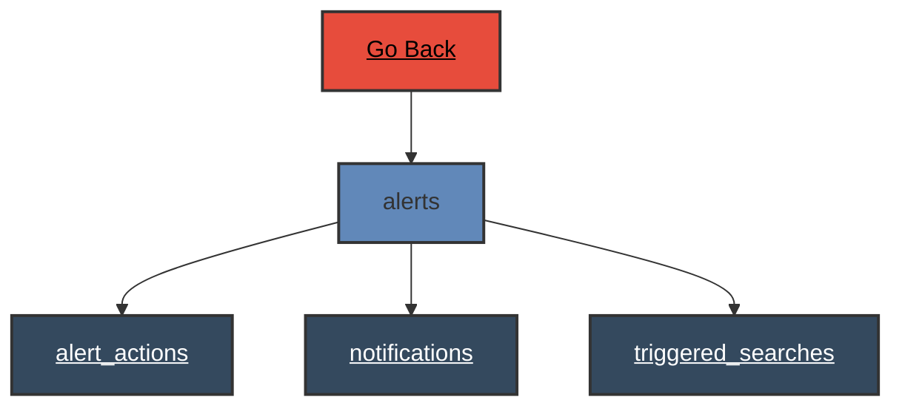

# Alerts

```mermaid
graph TD;
    Z[<a href="https://github.com/ncolyer/splunk-toolbox/blob/main/data" target="_blank" style="color:black">Go Back</a>]:::backLevelStyle
    Z --> A[alerts]:::firstLevelStyle
    A --> B[<a href="https://github.com/ncolyer/splunk-toolbox/blob/main/data/alert_actions/" target="_blank" style="color:white">alert_actions</a>]:::secondLevelStyle
    A --> C[<a href="https://github.com/ncolyer/splunk-toolbox/blob/main/data/notifications/" target="_blank" style="color:white">notifications</a>]:::secondLevelStyle
    A --> D[<a href="https://github.com/ncolyer/splunk-toolbox/blob/main/data/triggered_searches/" target="_blank" style="color:white">triggered_searches</a>]:::secondLevelStyle

    classDef backLevelStyle fill:#e74c3c,stroke:#333,stroke-width:2px,color:#ffffff;
    classDef firstLevelStyle fill:#6188b9,stroke:#333,stroke-width:2px;
    classDef secondLevelStyle fill:#34495e,stroke:#333,stroke-width:2px;
    classDef secondLevelStyleMissing fill:#000000,stroke:#333,stroke-width:2px;
```
 
# Alerts - Verb Documentation
 
Category                  Type                      Functionality             Specifics                
