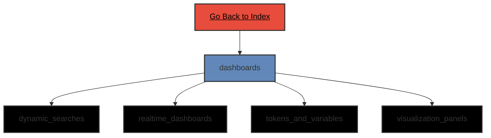

# dashboards

```mermaid
graph TD;
    Z[<a href="../" target="_blank" style="color:black">Go Back to Index</a>]:::backLevelStyle
    Z --> A[dashboards]:::firstLevelStyle
    A --> B[dynamic_searches]:::secondLevelStyleMissing
    A --> C[realtime_dashboards]:::secondLevelStyleMissing
    A --> D[tokens_and_variables]:::secondLevelStyleMissing
    A --> E[visualization_panels]:::secondLevelStyleMissing

    classDef backLevelStyle fill:#e74c3c,stroke:#333,stroke-width:2px,color:#ffffff;
    classDef firstLevelStyle fill:#6188b9,stroke:#333,stroke-width:2px;
    classDef secondLevelStyle fill:#34495e,stroke:#333,stroke-width:2px;
    classDef secondLevelStyleMissing fill:#000000,stroke:#333,stroke-width:2px;
```
