# Splunk Toolbox

```mermaid
graph TD;
    A[Click Items To Navigate]:::firstLevelStyle
    A --> B[<a href="../data/alerts/" target="_blank" style="color:white">alerts</a>]:::secondLevelStyle
    A --> C[<a href="../data/apps/" target="_blank" style="color:white">apps</a>]:::secondLevelStyle
    A --> D[<a href="../data/dashboards/" target="_blank" style="color:white">dashboards</a>]:::secondLevelStyle
    A --> E[<a href="../data/data_inputs/" target="_blank" style="color:white">data_inputs</a>]:::secondLevelStyle
    A --> F[<a href="../data/data_models/" target="_blank" style="color:white">data_models</a>]:::secondLevelStyle
    A --> G[<a href="../data/indexes/" target="_blank" style="color:white">indexes</a>]:::secondLevelStyle
    A --> H[<a href="../data/knowledge_objects/" target="_blank" style="color:white">knowledge_objects</a>]:::secondLevelStyle
    A --> I[<a href="../data/lookups/" target="_blank" style="color:white">lookups</a>]:::secondLevelStyle
    A --> J[<a href="../data/reports/" target="_blank" style="color:white">reports</a>]:::secondLevelStyle
    A --> K[<a href="../data/search_processing_language/" target="_blank" style="color:white">search_processing_language</a>]:::secondLevelStyle
    A --> L[<a href="../data/users_and_roles/" target="_blank" style="color:white">users_and_roles</a>]:::secondLevelStyle

    classDef backLevelStyle fill:#e74c3c,stroke:#333,stroke-width:2px,color:#ffffff;
    classDef firstLevelStyle fill:#6188b9,stroke:#333,stroke-width:2px;
    classDef secondLevelStyle fill:#34495e,stroke:#333,stroke-width:2px;
    classDef secondLevelStyleMissing fill:#000000,stroke:#333,stroke-width:2px;
```



## Naming Convention Pattern

There are many items within this repository. I wanted a meaningful categorization that also allowed me to find what I needed quickly at the command-line interface, especially for the litany of SPL files collected over time.

```markdown
<category>_<type>_<functionality>_<specifics>.spl
```

### Searching with `grep`

- **To find all security-related alert type spl queries**:

  ```bash
  grep -l 'alert_security_' *.spl
  ```

- **To find all performance-related ql queries**:

  ```bash
  grep -l '_performance_' *.spl
  ```

### Convention Adopted

- **`<category>`**: Represents category:
  - `alert`
  - `search`
  - `dashboard`
  - `lookup`
  - `datamodel`

- **`<type>`**: Describes the specific type:
  - `security`
  - `performance`
  - `network`
  - `dimension`

- **`<functionality>`**: Indicates the primary function or action:
  - `monitor`
  - `trigger`
  - `extract`
  - `transform`
  - `visualize`
  - `filter`
  - `enumeration`

- **`<specifics>`**: Additional specifics for special-case differentiation or reusable patterns:
  - `cpu_usage`
  - `failed_login`
  - `analyst_dashboard`
  - `network_traffic`

### Example Names

1. **Alert for monitoring failed logins:**

   ```markdown
   alert_security_trigger_failed_login.spl
   ```

2. **Search for retrieving CPU usage data:**

   ```markdown
   search_performance_monitor_cpu_usage.spl
   ```

3. **Dashboard for visualizing sales data:**

   ```markdown
   dashboard_analysts_visualize_monthly_performance.spl
   ```

4. **Lookup for filtering geospatial data:**

   ```markdown
   lookup_geospatial_filter_city_coordinates.spl
   ```

5. **Data model for accelerating network traffic analysis:**

   ```markdown
   datamodel_network_accelerated_traffic_analysis.spl
   ```

### Benefits of This Naming Convention

- **Consistency**: Ensures all files follow a similar pattern, making them easier to manage.
- **Clarity**: Provides a clear indication of what the `.spl` file does and where it belongs.
- **Searchability**: Facilitates easy searching and filtering using `grep` or other search tools. For instance, `grep 'alert_security_'` will quickly show all security-related alert queries.
- **Scalability**: The convention can be easily expanded as new categories or types emerge.
