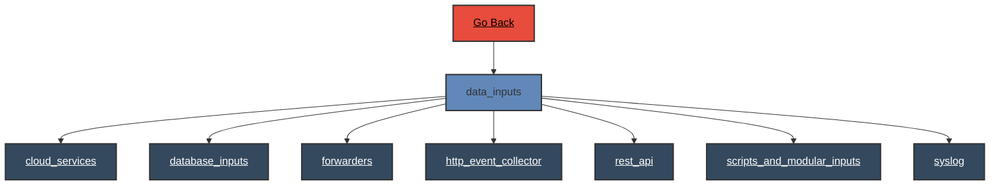

# Data Inputs

```mermaid
graph TD;
    Z[<a href="https://github.com/ncolyer/splunk-toolbox/blob/main/data" target="_blank" style="color:black">Go Back</a>]:::backLevelStyle
    Z --> A[data_inputs]:::firstLevelStyle
    A --> B[<a href="https://github.com/ncolyer/splunk-toolbox/blob/main/data/cloud_services/" target="_blank" style="color:white">cloud_services</a>]:::secondLevelStyle
    A --> C[<a href="https://github.com/ncolyer/splunk-toolbox/blob/main/data/database_inputs/" target="_blank" style="color:white">database_inputs</a>]:::secondLevelStyle
    A --> D[<a href="https://github.com/ncolyer/splunk-toolbox/blob/main/data/forwarders/" target="_blank" style="color:white">forwarders</a>]:::secondLevelStyle
    A --> E[<a href="https://github.com/ncolyer/splunk-toolbox/blob/main/data/http_event_collector/" target="_blank" style="color:white">http_event_collector</a>]:::secondLevelStyle
    A --> F[<a href="https://github.com/ncolyer/splunk-toolbox/blob/main/data/rest_api/" target="_blank" style="color:white">rest_api</a>]:::secondLevelStyle
    A --> G[<a href="https://github.com/ncolyer/splunk-toolbox/blob/main/data/scripts_and_modular_inputs/" target="_blank" style="color:white">scripts_and_modular_inputs</a>]:::secondLevelStyle
    A --> H[<a href="https://github.com/ncolyer/splunk-toolbox/blob/main/data/syslog/" target="_blank" style="color:white">syslog</a>]:::secondLevelStyle

    classDef backLevelStyle fill:#e74c3c,stroke:#333,stroke-width:2px,color:#ffffff;
    classDef firstLevelStyle fill:#6188b9,stroke:#333,stroke-width:2px;
    classDef secondLevelStyle fill:#34495e,stroke:#333,stroke-width:2px;
    classDef secondLevelStyleMissing fill:#000000,stroke:#333,stroke-width:2px;
```
 
# Data Inputs - Verb Documentation
 
Category                  Type                      Functionality             Specifics                
