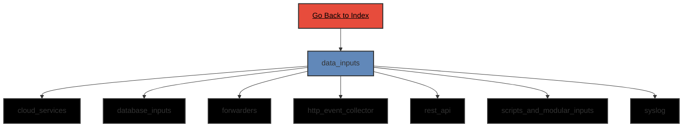

# data_inputs

```mermaid
graph TD;
    Z[<a href="../" target="_blank" style="color:black">Go Back to Index</a>]:::backLevelStyle
    Z --> A[data_inputs]:::firstLevelStyle
    A --> B[cloud_services]:::secondLevelStyleMissing
    A --> C[database_inputs]:::secondLevelStyleMissing
    A --> D[forwarders]:::secondLevelStyleMissing
    A --> E[http_event_collector]:::secondLevelStyleMissing
    A --> F[rest_api]:::secondLevelStyleMissing
    A --> G[scripts_and_modular_inputs]:::secondLevelStyleMissing
    A --> H[syslog]:::secondLevelStyleMissing

    classDef backLevelStyle fill:#e74c3c,stroke:#333,stroke-width:2px,color:#ffffff;
    classDef firstLevelStyle fill:#6188b9,stroke:#333,stroke-width:2px;
    classDef secondLevelStyle fill:#34495e,stroke:#333,stroke-width:2px;
    classDef secondLevelStyleMissing fill:#000000,stroke:#333,stroke-width:2px;
```
