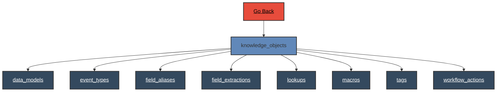

# Knowledge Objects

```mermaid
graph TD;
    Z[<a href="https://github.com/ncolyer/splunk-toolbox/blob/main/data" target="_blank" style="color:black">Go Back</a>]:::backLevelStyle
    Z --> A[knowledge_objects]:::firstLevelStyle
    A --> B[<a href="https://github.com/ncolyer/splunk-toolbox/blob/main/data/data_models/" target="_blank" style="color:white">data_models</a>]:::secondLevelStyle
    A --> C[<a href="https://github.com/ncolyer/splunk-toolbox/blob/main/data/event_types/" target="_blank" style="color:white">event_types</a>]:::secondLevelStyle
    A --> D[<a href="https://github.com/ncolyer/splunk-toolbox/blob/main/data/field_aliases/" target="_blank" style="color:white">field_aliases</a>]:::secondLevelStyle
    A --> E[<a href="https://github.com/ncolyer/splunk-toolbox/blob/main/data/field_extractions/" target="_blank" style="color:white">field_extractions</a>]:::secondLevelStyle
    A --> F[<a href="https://github.com/ncolyer/splunk-toolbox/blob/main/data/lookups/" target="_blank" style="color:white">lookups</a>]:::secondLevelStyle
    A --> G[<a href="https://github.com/ncolyer/splunk-toolbox/blob/main/data/macros/" target="_blank" style="color:white">macros</a>]:::secondLevelStyle
    A --> H[<a href="https://github.com/ncolyer/splunk-toolbox/blob/main/data/tags/" target="_blank" style="color:white">tags</a>]:::secondLevelStyle
    A --> I[<a href="https://github.com/ncolyer/splunk-toolbox/blob/main/data/workflow_actions/" target="_blank" style="color:white">workflow_actions</a>]:::secondLevelStyle

    classDef backLevelStyle fill:#e74c3c,stroke:#333,stroke-width:2px,color:#ffffff;
    classDef firstLevelStyle fill:#6188b9,stroke:#333,stroke-width:2px;
    classDef secondLevelStyle fill:#34495e,stroke:#333,stroke-width:2px;
    classDef secondLevelStyleMissing fill:#000000,stroke:#333,stroke-width:2px;
```
 
# Knowledge Objects - Verb Documentation
 
Category                  Type                      Functionality             Specifics                
