# Lookups

```mermaid
graph TD;
    Z[<a href="https://github.com/ncolyer/splunk-toolbox/blob/main/data" target="_blank" style="color:black">Go Back</a>]:::backLevelStyle
    Z --> A[lookups]:::firstLevelStyle
    A --> B[<a href="https://github.com/ncolyer/splunk-toolbox/blob/main/data/csv_files/" target="_blank" style="color:white">csv_files</a>]:::secondLevelStyle
    A --> C[<a href="https://github.com/ncolyer/splunk-toolbox/blob/main/data/external_lookups/" target="_blank" style="color:white">external_lookups</a>]:::secondLevelStyle
    A --> D[<a href="https://github.com/ncolyer/splunk-toolbox/blob/main/data/geospatial_lookups/" target="_blank" style="color:white">geospatial_lookups</a>]:::secondLevelStyle
    A --> E[<a href="https://github.com/ncolyer/splunk-toolbox/blob/main/data/kv_store/" target="_blank" style="color:white">kv_store</a>]:::secondLevelStyle

    classDef backLevelStyle fill:#e74c3c,stroke:#333,stroke-width:2px,color:#ffffff;
    classDef firstLevelStyle fill:#6188b9,stroke:#333,stroke-width:2px;
    classDef secondLevelStyle fill:#34495e,stroke:#333,stroke-width:2px;
    classDef secondLevelStyleMissing fill:#000000,stroke:#333,stroke-width:2px;
```

 
# Lookups - Verb Documentation
 
Category                  Type                      Functionality             Specifics                
lookup                    configuration             enumerate                 all                      
