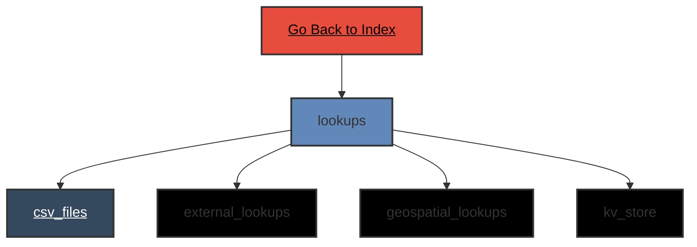

# lookups

```mermaid
graph TD;
    Z[<a href="../" target="_blank" style="color:black">Go Back to Index</a>]:::backLevelStyle
    Z --> A[lookups]:::firstLevelStyle
    A --> B[<a href="lookups/csv_files/" target="_blank" style="color:white">csv_files</a>]:::secondLevelStyle
    A --> C[external_lookups]:::secondLevelStyleMissing
    A --> D[geospatial_lookups]:::secondLevelStyleMissing
    A --> E[kv_store]:::secondLevelStyleMissing

    classDef backLevelStyle fill:#e74c3c,stroke:#333,stroke-width:2px,color:#ffffff;
    classDef firstLevelStyle fill:#6188b9,stroke:#333,stroke-width:2px;
    classDef secondLevelStyle fill:#34495e,stroke:#333,stroke-width:2px;
    classDef secondLevelStyleMissing fill:#000000,stroke:#333,stroke-width:2px;
```
