# Search Processing Language

```mermaid
graph TD;
    Z[<a href="https://github.com/ncolyer/splunk-toolbox/blob/main/data" target="_blank" style="color:black">Go Back</a>]:::backLevelStyle
    Z --> A[search_processing_language]:::firstLevelStyle
    A --> B[<a href="https://github.com/ncolyer/splunk-toolbox/blob/main/data/generating_reports/" target="_blank" style="color:white">generating_reports</a>]:::secondLevelStyle
    A --> C[<a href="https://github.com/ncolyer/splunk-toolbox/blob/main/data/macros/" target="_blank" style="color:white">macros</a>]:::secondLevelStyle
    A --> D[<a href="https://github.com/ncolyer/splunk-toolbox/blob/main/data/pipelines/" target="_blank" style="color:white">pipelines</a>]:::secondLevelStyle
    A --> E[<a href="https://github.com/ncolyer/splunk-toolbox/blob/main/data/search_commands/" target="_blank" style="color:white">search_commands</a>]:::secondLevelStyle
    A --> F[<a href="https://github.com/ncolyer/splunk-toolbox/blob/main/data/triggering_alerts/" target="_blank" style="color:white">triggering_alerts</a>]:::secondLevelStyle

    classDef backLevelStyle fill:#e74c3c,stroke:#333,stroke-width:2px,color:#ffffff;
    classDef firstLevelStyle fill:#6188b9,stroke:#333,stroke-width:2px;
    classDef secondLevelStyle fill:#34495e,stroke:#333,stroke-width:2px;
    classDef secondLevelStyleMissing fill:#000000,stroke:#333,stroke-width:2px;
```

 
# Search Processing Language - Verb Documentation
 
Category                  Type                      Functionality             Specifics                
rest                      configuration             visualize                 instance                 
