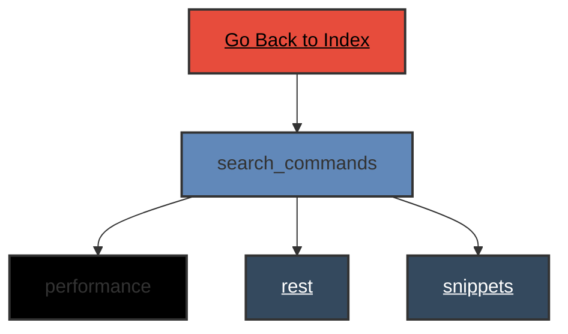

# search_commands

```mermaid
graph TD;
    Z[<a href="../" target="_blank" style="color:black">Go Back to Index</a>]:::backLevelStyle
    Z --> A[search_commands]:::firstLevelStyle
    A --> B[performance]:::secondLevelStyleMissing
    A --> C[<a href="search_commands/rest/" target="_blank" style="color:white">rest</a>]:::secondLevelStyle
    A --> D[<a href="search_commands/snippets/" target="_blank" style="color:white">snippets</a>]:::secondLevelStyle

    classDef backLevelStyle fill:#e74c3c,stroke:#333,stroke-width:2px,color:#ffffff;
    classDef firstLevelStyle fill:#6188b9,stroke:#333,stroke-width:2px;
    classDef secondLevelStyle fill:#34495e,stroke:#333,stroke-width:2px;
    classDef secondLevelStyleMissing fill:#000000,stroke:#333,stroke-width:2px;
```
