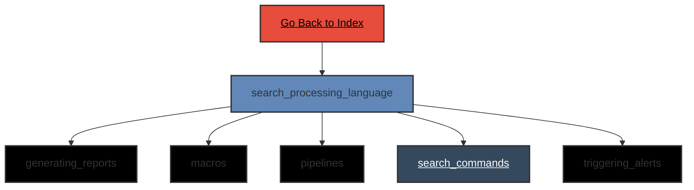

# search_processing_language

```mermaid
graph TD;
    Z[<a href="../" target="_blank" style="color:black">Go Back to Index</a>]:::backLevelStyle
    Z --> A[search_processing_language]:::firstLevelStyle
    A --> B[generating_reports]:::secondLevelStyleMissing
    A --> C[macros]:::secondLevelStyleMissing
    A --> D[pipelines]:::secondLevelStyleMissing
    A --> E[<a href="search_processing_language/search_commands/" target="_blank" style="color:white">search_commands</a>]:::secondLevelStyle
    A --> F[triggering_alerts]:::secondLevelStyleMissing

    classDef backLevelStyle fill:#e74c3c,stroke:#333,stroke-width:2px,color:#ffffff;
    classDef firstLevelStyle fill:#6188b9,stroke:#333,stroke-width:2px;
    classDef secondLevelStyle fill:#34495e,stroke:#333,stroke-width:2px;
    classDef secondLevelStyleMissing fill:#000000,stroke:#333,stroke-width:2px;
```
