# Splunk Toolbox

## Overview

This repository contains a collection of resources, queries, and more aimed at enhancing Splunk workflows. The structure is designed to be modular, allowing for easy expansion and integration of additional tools or data as needed.

```mermaid
graph TD;
    A[<b>ACTION: Click Items To Navigate</b>]:::rootStyle
    A --> B[<a href="data/data_inputs/" target="_blank"; style="color:white">Data Inputs</a>]:::firstLevelStyle
    B --> B1["REST API,\nForwarders,\nHTTP Event\nCollector,\nScripts,\nSyslog,\nCloud Services,\nDatabase Inputs"]:::commentStyle
    A --> C[<a href="data/indexes/" target="_blank"; style="color:white">Indexes</a>]:::firstLevelStyle
    C --> C1["Raw Data,\nSummary Indexes,\nMetric Indexes"]:::commentStyle
    A --> D[<a href="data/search_processing_language/" target="_blank"; style="color:white">Search Processing Language</a>]:::firstLevelStyle
    D --> D1["Search Commands,\nPipelines,\nMacros,\nGenerate Reports,\nTrigger Alerts"]:::commentStyle
    A --> E[<a href="data/data_models/" target="_blank"; style="color:white">Data Models</a>]:::firstLevelStyle
    E --> E1["Accelerated,\nPivot Tables,\nCommon Info Model"]:::commentStyle
    A --> F[<a href="data/lookups/" target="_blank"; style="color:white">Lookups</a>]:::firstLevelStyle
    F --> F1["CSV Files,\nKV Store,\nExternal Lookups,\nGeospatial"]:::commentStyle
    A --> G[<a href="data/knowledge_objects/" target="_blank"; style="color:white">Knowledge Objects</a>]:::firstLevelStyle
    G --> G1["Field Extractions,\nEvent Types,\nTags,\nLookups,\nData Models,\nMacros,\nWorkflow Actions,\nField Aliases"]:::commentStyle
    A --> H[<a href="data/dashboards/" target="_blank"; style="color:white">Dashboards</a>]:::firstLevelStyle
    H --> H1["Visualization,\nDynamic Searches,\nTokens,\nReal-Time"]:::commentStyle
    A --> I[<a href="data/alerts" target="_blank"; style="color:white">Alerts</a>]:::firstLevelStyle
    I --> I1["Triggered Searches,\nNotifications,\nActions"]:::commentStyle
    A --> J[<a href="data/reports" target="_blank"; style="color:white">Reports</a>]:::firstLevelStyle
    J --> J1["Scheduled,\nExport,\nReport Scheduling"]:::commentStyle
    A --> K[<a href="data/apps/" target="_blank"; style="color:white">Apps</a>]:::firstLevelStyle
    K --> K1["Splunkbase,\nCustom Apps,\nDeployment"]:::commentStyle
    A --> L[<a href="data/users_and_roles/" target="_blank"; style="color:white">Users and Roles</a>]:::firstLevelStyle
    L --> L1["Access Controls,\nPermissions,\nRole Inheritance"]:::commentStyle

    classDef rootStyle fill:#2c3e50,stroke:#333,stroke-width:2px;
    classDef firstLevelStyle fill:#6188b9,stroke:#333,stroke-width:2px;
    classDef commentStyle fill:#000000,stroke:#333,stroke-width:1px,font-size:12px,font-style:italic;

```



## Naming Convention Pattern

There are many items within this repository. I wanted a meaningful categorization that also allowed me to find what I needed quickly at command-line interface, especially for the littany of SPL files collected over time.

```markdown
<category>_<type>_<functionality>_<specifics>.spl
```

### Explanation of Each Component

- **`<category>`**: Represents the broad category under which the `.spl` file falls:
  - `alert`
  - `search`
  - `dashboard`
  - `lookup`
  - `datamodel`
  - `rest`

- **`<type>`**: Describes the specific type within the category:
  - `security`
  - `performance`
  - `network`
  - `dimension`
  - `configuration`

- **`<functionality>`**: Indicates the primary function or action of the `.spl` file:
  - `monitor`
  - `trigger`
  - `extract`
  - `transform`
  - `visualize`
  - `filter`
  - `enumerate`

- **`<specifics>`**: Additional specifics that differentiate this `.spl` file from others:
  - `cpu_usage`
  - `failed_login`
  - `analyst_dashboard`
  - etc.

### Example Names

1. **Alert for monitoring failed logins:**

   ```markdown
   alert_security_trigger_failed_login.spl
   ```

2. **Search for retrieving CPU usage data:**

   ```markdown
   search_performance_monitor_cpu_usage.spl
   ```

3. **Dashboard for visualizing analyst data:**

   ```markdown
   dashboard_analysts_visualize_monthly_performance.spl
   ```

4. **Lookup for geospatial data:**

   ```markdown
   lookup_geospatial_filter_city_coordinates.spl
   ```

5. **Data model for accelerated network traffic analysis:**

   ```markdown
   datamodel_network_accelerated_traffic_analysis.spl
   ```

### Benefits of This Naming Convention

- **Consistency**: Ensures all files follow a similar pattern, making them easier to manage.
- **Clarity**: The name gives a clear indication of what the `.spl` file does and where it belongs.
- **Searchability**: Facilitates easy searching and filtering using `grep` or other search tools. For instance, `grep 'alert_security_'` will quickly show all security-related alert queries.
- **Scalability**: The convention can be easily expanded as new categories or types emerge.

### Searching with `grep`

- **To find all security-related alerts**:

  ```bash
  grep -l 'alert_security_' *.spl
  ```

- **To find all SPL files related to performance**:

  ```bash
  grep -l '_performance_' *.spl
  ```
